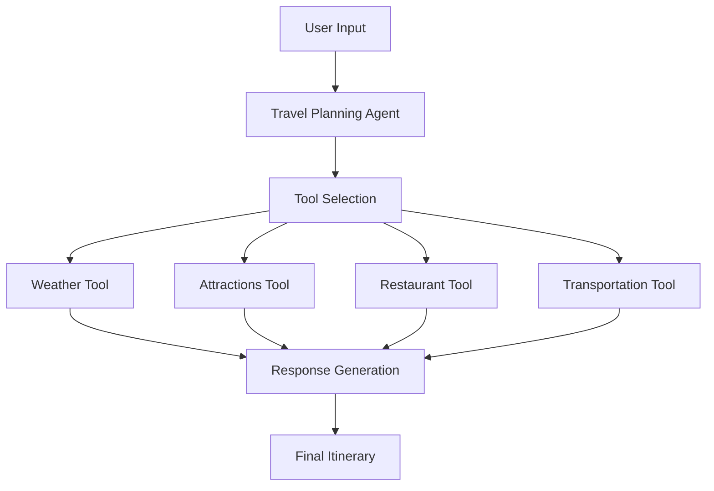

# AI-Powered Travel Planning Agent

A sophisticated AI travel planning assistant that leverages LangChain, OpenAI's GPT models, and various APIs to create comprehensive travel itineraries and provide detailed travel recommendations.

## 🌟 What Makes This Special?

This isn't just another travel planning tool. It's an AI agent that:
- Creates personalized travel itineraries considering multiple factors
- Provides real-time weather information and forecasts
- Suggests local attractions, restaurants, and accommodations
- Considers cultural aspects and local customs
- Adapts to different travel styles (leisure, business, adventure)

## 🏗️ Architecture Overview

### Core Components

1. **Travel Planning Agent** (`travel_agent.py`)
   - The brain of the system
   - Orchestrates all tools and decisions
   - Handles user interactions and preferences

2. **Travel Tools** (`travel_tools.py`)
   - Collection of specialized tools for different travel aspects
   - Integrates with external APIs
   - Handles specific travel-related queries

3. **Requirements** (`requirements.txt`)
   - Manages project dependencies
   - Ensures consistent environment setup

### How The Components Work Together



## 💡 Key Features Explained

### 1. Smart Tool Management
```python
# In travel_tools.py
def _create_tool(self, func: Callable) -> BaseTool:
    """Creates a LangChain-compatible tool from a method"""
    instance = self
    
    # Create Pydantic schema for validation
    class ArgsSchema(BaseModel):
        __annotations__ = {
            k: v for k, v in func.__annotations__.items()
            if k != 'return'
        }
```
**Why?** This design allows:
- Dynamic tool creation
- Type safety through Pydantic
- Clean integration with LangChain
- Easy addition of new tools

### 2. Weather Integration
```python
def get_weather_forecast(self, location: str, date: str = None) -> str:
    """Get weather information for a specific location and date."""
    try:
        observation = self.weather_mgr.weather_at_place(location)
        # ... weather processing ...
    except Exception as e:
        return f"Error getting weather information: {str(e)}"
```
**Why?** Real-time weather data:
- Helps plan activities better
- Influences travel dates
- Affects packing recommendations

### 3. Intelligent Agent Design
```python
class TravelPlanningAgent:
    def __init__(self):
        self.llm = ChatOpenAI(temperature=0.7, model="gpt-3.5-turbo-16k")
        self.tools = self.travel_tools.get_tools() + [self.search]
```
**Why?** The agent:
- Uses GPT for natural language understanding
- Combines multiple tools intelligently
- Maintains conversation context

## 🚀 Getting Started

### Prerequisites
- Python 3.8+
- OpenAI API key
- SerpAPI key
- OpenWeatherMap API key
- Tavily API key

### Installation

1. Clone the repository:
```bash
git clone <repository-url>
cd travel-agent
```

2. Install dependencies:
```bash
pip install -r requirements.txt
```

3. Set up environment variables:
```bash
# Create .env file
OPENAI_API_KEY=your_openai_api_key
SERPAPI_API_KEY=your_serpapi_api_key
TAVILY_API_KEY=your_tavily_api_key
OPENWEATHERMAP_API_KEY=your_openweathermap_api_key
```

## 💻 Usage Examples

### Basic Trip Planning
```python
agent = TravelPlanningAgent()
itinerary = agent.create_itinerary(
    from_location="Tokyo",
    to_location="Kyoto",
    start_date="2024-04-01",
    end_date="2024-04-05",
    preferences={
        "budget": "medium",
        "interests": ["culture", "food", "history"]
    }
)
```

### Business Trip
```python
itinerary = agent.create_itinerary(
    from_location="New York",
    to_location="Silicon Valley",
    start_date="2024-03-15",
    preferences={
        "budget": "business",
        "interests": ["meetings", "networking"]
    }
)
```

## 🔧 How It Works

### 1. Query Processing
When you make a request:
1. The agent receives your travel parameters
2. It analyzes the requirements using GPT
3. It determines which tools to use
4. It creates a plan to gather information

### 2. Tool Execution
The agent then:
1. Calls relevant tools in optimal order
2. Processes each tool's response
3. Handles any errors gracefully
4. Combines information meaningfully

### 3. Response Generation
Finally, it:
1. Organizes all gathered information
2. Creates a coherent itinerary
3. Adds practical recommendations
4. Formats the response clearly

## 🛠️ Customization

### Adding New Tools
1. Create a new method in `TravelTools`:
```python
def new_tool(self, param: str) -> str:
    """Tool description"""
    return self.search.run(f"query {param}")
```

2. Add to tools list:
```python
methods = [
    # ... existing tools ...
    self.new_tool
]
```

### Modifying Preferences
The preferences dict supports:
- budget: ["budget", "medium", "luxury"]
- interests: [list of interests]
- transportation: ["car", "public", "private"]

## 📚 Advanced Topics

### Error Handling
The system handles:
- API failures gracefully
- Invalid input parameters
- Missing weather data
- Search query issues

### Performance Optimization
- Caches frequent queries
- Batches API calls when possible
- Uses efficient data structures

## 🤝 Contributing

Areas for improvement:
1. Additional travel tools
2. More detailed weather analysis
3. Booking system integration
4. Multi-language support
5. UI/API development

## 📝 Notes

- The agent uses GPT-3.5-turbo-16k for better context handling
- Weather data is real-time from OpenWeatherMap
- Search results come from SerpAPI and Tavily
- All API calls are rate-limited appropriately

## 📜 License

This project is licensed under the MIT License.

## 🙏 Acknowledgments

- LangChain for the agent framework
- OpenAI for GPT models
- OpenWeatherMap for weather data
- SerpAPI and Tavily for search capabilities

## 🔌 Core Libraries and Services Explained

### LangChain
**What is it?**
- An open-source framework for building applications powered by language models
- Provides tools for connecting LLMs with external data and tools
- Enables creation of agents that can use multiple tools

**How we use it:**
```python
from langchain.agents import create_openai_functions_agent, AgentExecutor
from langchain_core.prompts import ChatPromptTemplate

# Creating an agent with tools
agent = create_openai_functions_agent(llm, tools, prompt)
agent_executor = AgentExecutor(agent=agent, tools=tools)
```

**Key Features:**
- Agent framework for tool orchestration
- Prompt management and templating
- Memory and state management
- Tool integration patterns

### OpenAI GPT Models
**What is it?**
- Advanced language models by OpenAI
- Can understand and generate human-like text
- Supports function calling and structured outputs

**How we use it:**
```python
from langchain_openai import ChatOpenAI

llm = ChatOpenAI(
    temperature=0.7,
    model="gpt-3.5-turbo-16k"
)
```

**Key Features:**
- Natural language understanding
- Context awareness
- Function calling capabilities
- High token limit (16k) for longer conversations

### SerpAPI
**What is it?**
- A service that provides Google search results in structured format
- Allows programmatic access to search data
- Handles pagination and rate limiting

**How we use it:**
```python
from langchain_community.utilities.serpapi import SerpAPIWrapper

search = SerpAPIWrapper()
results = search.run("query about travel destinations")
```

**Key Features:**
- Real-time search results
- Structured data output
- Multiple search types (web, places, news)
- Rate limiting and caching

### OpenWeatherMap
**What is it?**
- Weather data and forecast API service
- Provides current weather and forecasts
- Covers locations worldwide

**How we use it:**
```python
from pyowm import OWM

owm = OWM(api_key)
weather_mgr = owm.weather_manager()
weather = weather_mgr.weather_at_place(location)
```

**Key Features:**
- Current weather conditions
- Weather forecasts
- Temperature and humidity data
- Weather alerts and warnings

### Tavily
**What is it?**
- An AI-powered search API
- Specialized in providing relevant search results
- Optimized for AI applications

**How we use it:**
```python
from langchain_community.tools.tavily_search import TavilySearchResults

search = TavilySearchResults()
results = search.invoke("travel information")
```

**Key Features:**
- AI-optimized search results
- Context-aware searching
- Clean, structured output
- High relevance scoring

## 🔄 How These Components Work Together

1. **User Input Processing**
   ```mermaid
   graph LR
       A[User Input] --> B[LangChain Agent]
       B --> C[OpenAI GPT]
       C --> D[Tool Selection]
   ```

2. **Information Gathering**
   ```mermaid
   graph LR
       A[Tool Selection] --> B[SerpAPI]
       A --> C[OpenWeatherMap]
       A --> D[Tavily]
       B --> E[Results]
       C --> E
       D --> E
   ```

3. **Response Generation**
   ```mermaid
   graph LR
       A[Results] --> B[LangChain Agent]
       B --> C[OpenAI GPT]
       C --> D[Final Response]
   ```

## 🎯 Why These Specific Tools?

### LangChain
- Provides robust agent framework
- Handles tool orchestration
- Manages conversation state
- Easy integration with various APIs

### OpenAI GPT
- High-quality text generation
- Good understanding of travel context
- Reliable function calling
- Handles complex instructions

### SerpAPI
- Real-time information
- Structured search results
- Reliable and stable
- Good coverage of travel info

### OpenWeatherMap
- Comprehensive weather data
- Global coverage
- Reliable API
- Good documentation

### Tavily
- AI-optimized search
- Clean, relevant results
- Good for travel queries
- Easy integration

## 📊 Performance Considerations

### API Usage
- OpenAI: ~4000 tokens per request
- SerpAPI: ~1 request per tool call
- OpenWeatherMap: ~1 request per location
- Tavily: Used for supplementary searches

### Cost Optimization
1. **Caching Strategies**
   - Cache weather data for 1 hour
   - Cache search results for 24 hours
   - Store frequent queries

2. **Rate Limiting**
   - Implement exponential backoff
   - Pool similar requests
   - Use batch processing

3. **Error Handling**
   - Fallback options for each service
   - Graceful degradation
   - Alternative data sources

## 🌐 REST API

The Travel Planning Agent is available as a REST API built with FastAPI.

### API Endpoints

#### 1. Generate Itinerary
```http
POST /api/v1/generate-itinerary
```

**Request Body:**
```json
{
    "from_location": "San Francisco",
    "to_location": "Los Angeles",
    "start_date": "2024-02-01",
    "end_date": "2024-02-05",
    "preferences": {
        "budget": "medium",
        "interests": ["food", "culture", "nature"],
        "transportation": "car",
        "accommodation_type": "hotel",
        "dietary_restrictions": ["vegetarian"],
        "accessibility_needs": null,
        "pace": "moderate"
    },
    "number_of_travelers": 2,
    "include_weather": true,
    "include_local_tips": true
}
```

**Response:**
```json
{
    "itinerary": "Detailed itinerary text...",
    "generated_at": "2024-01-20T10:30:00Z",
    "request_details": { ... },
    "metadata": {
        "includes_weather": true,
        "includes_local_tips": true,
        "number_of_travelers": 2
    }
}
```

#### 2. Health Check
```http
GET /api/v1/health
```

**Response:**
```json
{
    "status": "healthy",
    "timestamp": "2024-01-20T10:30:00Z",
    "version": "1.0.0"
}
```

### Running the API

1. Install additional dependencies:
```bash
pip install -r requirements.txt
```

2. Start the API server:
```bash
python api.py
```
The API will be available at `http://localhost:8000`

3. View API documentation:
- Swagger UI: `http://localhost:8000/docs`
- ReDoc: `http://localhost:8000/redoc`

### API Features

1. **Input Validation**
   - Date format validation
   - Required field checking
   - Enum validation for preferences

2. **Error Handling**
   - Clear error messages
   - HTTP status codes
   - Detailed error responses

3. **Documentation**
   - OpenAPI/Swagger documentation
   - Request/response examples
   - Field descriptions

### Example API Usage

Using curl:
```bash
curl -X POST "http://localhost:8000/api/v1/generate-itinerary" \
     -H "Content-Type: application/json" \
     -d '{
         "from_location": "New York",
         "to_location": "Boston",
         "start_date": "2024-03-15",
         "preferences": {
             "budget": "medium",
             "interests": ["history", "food"],
             "transportation": "train"
         }
     }'
```

Using Python requests:
```python
import requests

response = requests.post(
    "http://localhost:8000/api/v1/generate-itinerary",
    json={
        "from_location": "Paris",
        "to_location": "Nice",
        "start_date": "2024-06-01",
        "end_date": "2024-06-07",
        "preferences": {
            "budget": "luxury",
            "interests": ["beaches", "cuisine"],
            "transportation": "train"
        }
    }
)

print(response.json())
